<div align=center>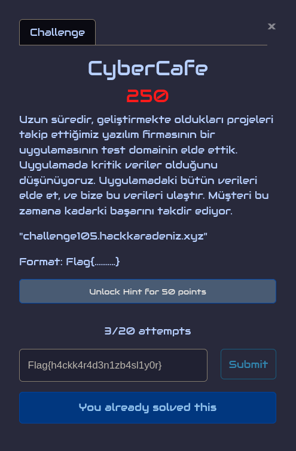</div>

<br>

Selam, ben Şefik Efe. HackKaradeniz 2022 yarışmasındaki sorular arasından bir tek bu soru için writeup hazırlıyorum. Bunun sebeplerinden bir tanesi benim için ayrıcalıklı bir yere sahip olması.

Mutluyum, çünkü hayatımda ilk defa SQLMAP'in SQLi olmadığını söylediği bir girdi noktasından enjeksiyona muvaffak oldum.

Gelelim genel değerlendirmeye, soru iki aşamadan oluşuyor İkinci aşaması kaliteli ve ileri seviye denebilecek nitelikte. Aynı zamanda yarışma esnasında bana en çok 'vakit kaybettiren' sorudur kendisi, ki bunun da sebebini en son anlayacaksınız.

Buradan CyberCafe yazarına selam gönderiyor, Flag'i daha adam akıllı bir yere koyamadınız mı diyerek kınıyor ama yine de böyle bir soruyu yazdığından dolayı teşekkür ediyorum.

Ayrıca [Yusuf Saraçlıoğlu](https://github.com/the-src) arkadaşıma da kafamda başka bir soruya bakmak varken bana bu soruda hatırı sayılır miktarda foothold verdiğinden dolayı da teşekkür ediyorum.

Twitter: [@f4T1H21](https://twitter.com/f4T1H21)<br>
LinkedIn: [Şefik Efe](https://www.linkedin.com/in/şefik-efe)<br>
HackTheBox: [f4T1H](https://app.hackthebox.com/profile/184235)<br>

---

# Bilgi toplama
<div align="center">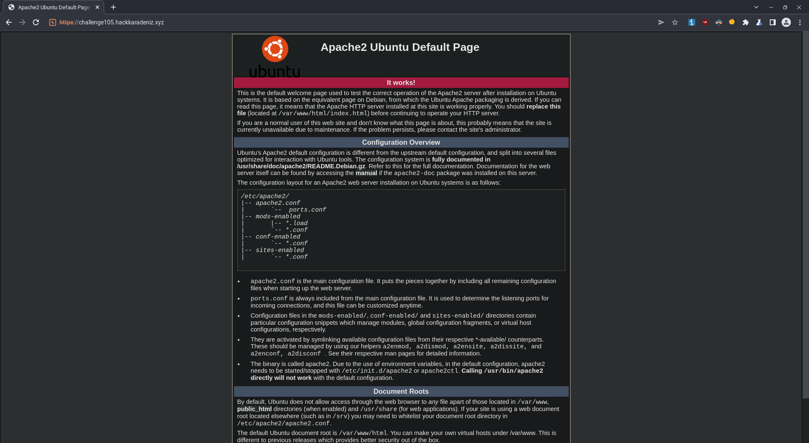</div>

Açıklamayı incelediğimizde bunun bir test domaini olduğunu söylemesi, ürün (production) ortamda olmaması dolayısıyla arama motoru crawlerlarının erişmemesi istenmiş olabileceğinden `/robots.txt` dosyasına bakabiliriz.

<div align="center">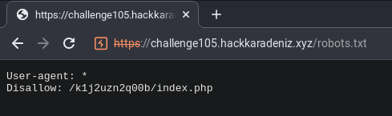</div>

Scope'umuz belli oldu: `challenge105.hackkaradeniz.xyz/k1j2uzn2q00b`

Her şeyden önve hızlı bir dizin taraması sonucunda `/k1j2uzn2q00b/includes` isimli bir dizin görüyoruz.

__Tüyo:__ `/includes` dizini içerisindeki varsa `php` dosyalarının isimleri bize backend'te neler döndüğüne dair fikir verebilir.

```console
root@f4T1H:~# gobuster -q dir -u https://challenge105.hackkaradeniz.xyz/k1j2uzn2q00b/ -w /usr/share/wordlists/dirb/common.txt -x .txt,.php,.js -e -t 75 
https://challenge105.hackkaradeniz.xyz/k1j2uzn2q00b/assets (Status: 301)
https://challenge105.hackkaradeniz.xyz/k1j2uzn2q00b/images (Status: 301)
https://challenge105.hackkaradeniz.xyz/k1j2uzn2q00b/includes (Status: 301)
https://challenge105.hackkaradeniz.xyz/k1j2uzn2q00b/index.php (Status: 200)
https://challenge105.hackkaradeniz.xyz/k1j2uzn2q00b/logout.php (Status: 302)
https://challenge105.hackkaradeniz.xyz/k1j2uzn2q00b/vendors (Status: 301)
```

<div align="center">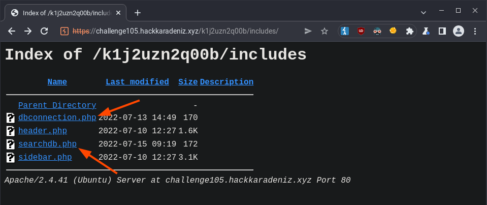</div>

`dbconnection` ve `searchdb` anahtar kelimeleri bir SQL Injection sorusuyla karşı karsıya olduğumuzu söylüyor olabilir.

Dikkat ederseniz daha web sitesini adam akıllı incelemeden ne tür zaafiyetler arayacağımızı ve hangi payloadları kullanacağımızı tahmin edebiliyoruz.

Artık anasayfayı incelemenin vakti geldi.

# SQLi Auth Bypass
`/k1j2uzn2q00b/index.php` dosyasında bir login form var. Az önceki tahminlerimizden yola çıkarak SQLi ile bypass etmeyi denediğimizde başarılı sonuç alıyoruz.

<div align="center">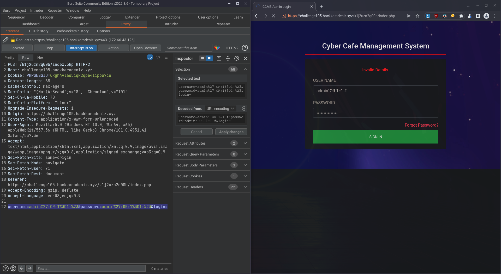</div>

# Bilgi toplamaya devam
Bu arada veritabanı türünü de payloadlarda yorum olarak işaretlemek maksadıyla kullandığımız `#` işaretinden yola çıkarak MySQL olarak saptadık.

Bence burada üstünde durulabilecek noktalardan bir tanesi, sabit değişkeninin bypass payloadı girilen `password` parametresi olduğu, bağımsız değişkenlerinin `username` parametresine girilecek `admin' and 1=1#` ve `admin' and 1=0#` payloadları sonucunda sunucudan dönen cevabın da bağımlı değişkenler olduğu bir deney yapılmasıdır.

Bir başka deyişle:<br>
Eğer ki bizim kontrol ettiğimiz tek değişken `username` bölümüne birilen payloadlar iken sözkonusu iki payload'a sunucu tarafından farklı cevap dönülüyorsa o zaman bütün veritabanına `username` parametresi üzerinden yapılacak bir enjeksiyonla erişim kazanmak denenebilinirdi.

Lâkin istenilen çözümün bu olduğunu düşünmediğimden ve açılan sayfayı merak ettiğimden dolayı yarışma esnasında bunu kafamın bir köşesine yazdım ve ilerlemeye devam ettim.

<div align="center">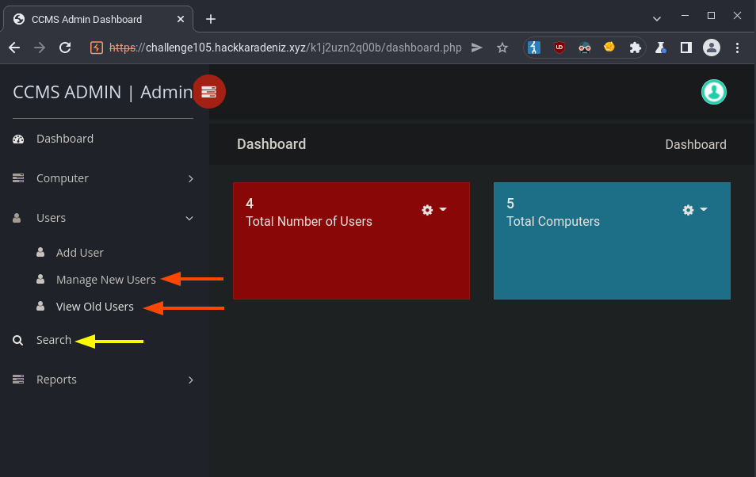</div>

Açılan sayfaya serice göz attıktan sonra, kullanıcılarla alakalı sayfalar ve bir arama sayfası olduğunu görüyoruz. İlk tahminleri alalım ??

Kullanıcıların listelendiği iki sayfayı şekildeki iki kırmızı ok ile gösterdim.

<div align="center">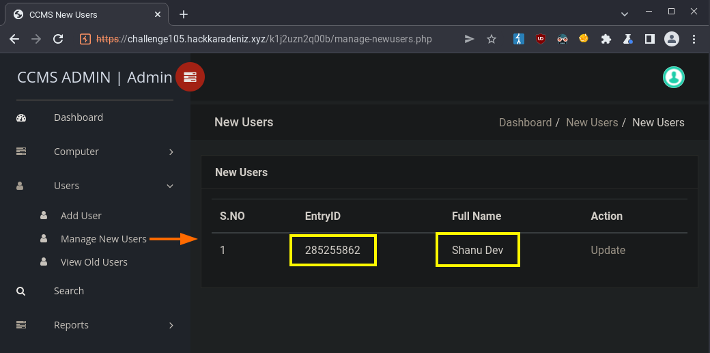</div>

Mevzubahis sayfaları incelediğimizde iki tane acayip önemli şey görüyoruz.

1) Kullanıcıya ait ID
2) Kullanıcı ismi

Az sonra ehemmiyetini idrâk edeceğimiz bu iki mâlumâtı bir kenara not aldıktan sonra, arama sayfasını inceleyelim.

<div align="center">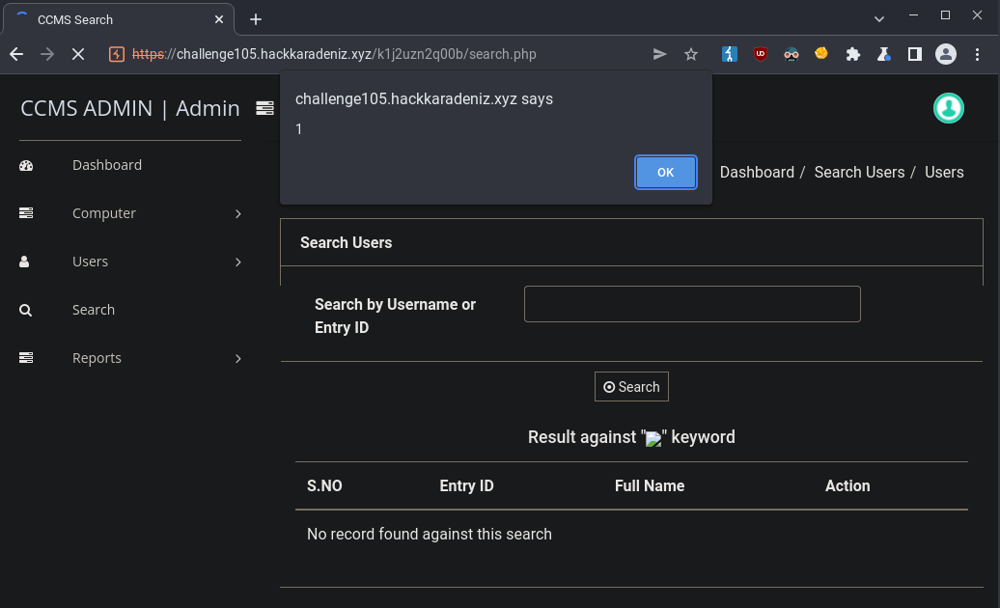</div>

Bir XSS almadan devam etmek olmaz, buradan TOKİ yolunda emin adımlarla ilerlediğimi de beyan etmek istiyorum :)

<div align="center">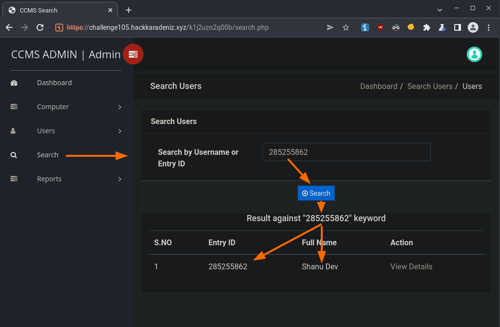</div>

Kullanıcıların `Entry ID` lerine veya kullanıcı adlarına göre arama yapılabilinen basit bir arama sayfası gibi görünüyor.
Test etmek için az önceki `Shanu Dev` isimli kullanıcıya ait `Entry ID` değerini girdiğimizde kullanıcıyı karşımıza getirdi.

# Boolean Based Blind SQLi tespiti

Şimdi geldik zurnanın zırt dediği yere, burada SQLi var mı yok mu nasıl anlayacağız.

Bildiğimiz gibi SQLi'ların türleri vardır:
- UNION tabanlı
- Hata tabanlı
- Boolean tabanlı (Blind)
- Zaman tabanlı &nbsp; (Blind)
- Out Of Band &ensp;&ensp;&ensp;(Blind)

Her çeşidi anlamanın değişik yolları var. Yarışma esnasında birkaç `'` denemesinden sonra UNION ve Error tabanlı enjeksiyonları eledim ve Boolean tabanlı enjeksiyon tespiti yapmaya koyuldum.

Şimdi sizi backend'te nasıl bir sorgunun çalıştığını ve bizden alınan girdinin sorgunun neresine konuşlandırıldığını tasavvur etmeye davet ediyorum.

Basitçe aşağıdaki gibi bir şey düşünebiliriz.

```sql
SELECT numara,id,kullanici_ismi, FROM kullanicilar WHERE id = '{girdi}' OR kullanici_ismi LIKE '%{girdi}%';
```

Dikkat edersek eğer, sorguda birden fazla yere bizden alınan girdi konuluyor. Sorgudaki ilk girdi alanından sonra gelen her şey payload'ımızın sonuna koyacağımız `#` ile yorum hâline geleceğinden dolayı sorguda eğer ID kontrolü daha önceyse ID'yi, kullanıcı ismi kontrolü daha önceyse de kullanıcı ismini doğru olduğunu bildiğimiz değer olarak kullanabiliriz.

Önce ID seçeneği için iki payload yazdım ve çalıştırdığımda farklı sonuçlar aldım ki bu da demek oluyor ki girdimizdeki sorgu ifadeleri başarılı bir şekilde MySQL veritabanı tarafından işleniyor.

```
285255862' and 1=1#
285255862' and 1=0#
```

<div align="center">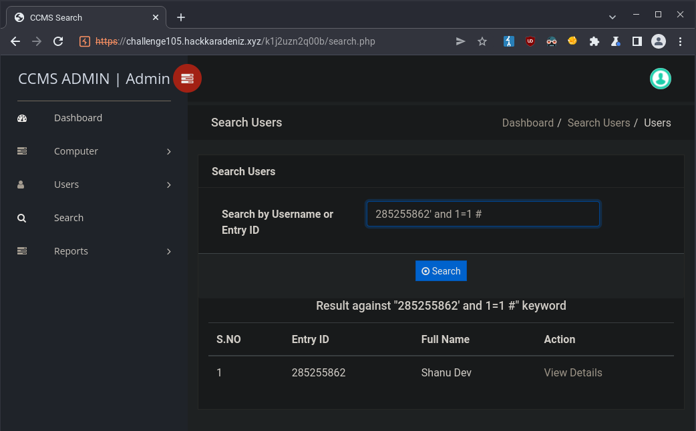</div>
<div align="center">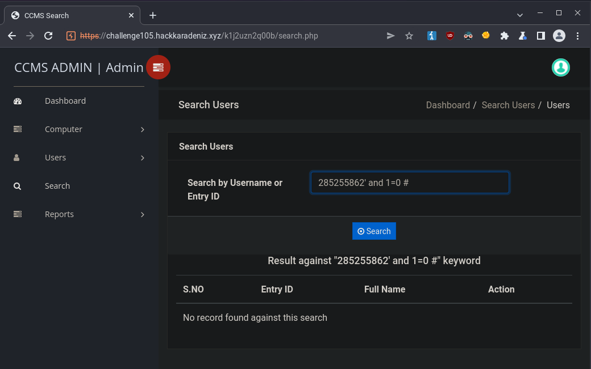</div>

Var yok oyunumun işe yaradığını gördüğümde heyecanlandım ve emin olabilmek için hemen BurpSuite'in Intruder aracını kullanarak veritabanındaki geçerli şemanın ilk tablosunun isminin ilk harfini dumpladım.

# Exploitation
Bu aşamada eğer izlemediyseniz [Mehmet İnce](xx) Hoca'nın Boolean Based SQLi ve exploitation yollarını anlattığı [videoyu](https://www.youtube.com/watch?v=WtHnT73NaaQ&t=4834s) izlemenizi tavsiye ederim.

Script yazmadan önce giden HTTP requestlerinin detaylarını ve girdinin hangi parametrede gittiğini saptadım.

<div align="center">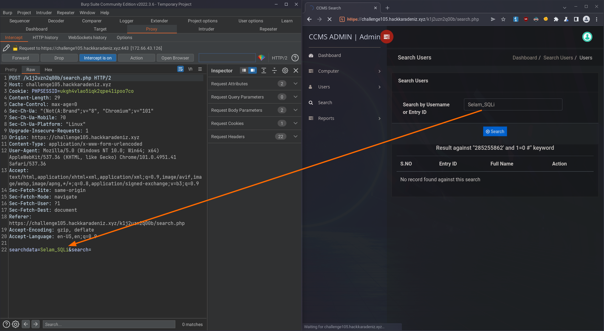</div>

Ardından scripti yazmaya başladım. Mantığı programlarken geçen senenin (2021) Aralık ayında PortSwigger'ın web güvenliği akademisini çözerken Boolean tabanlı Blind SQLi ların exploitation aşamasını otomatikleştirmek için yazdığım program, exploitation için yazdığım script üzerinde çalışırken işimi çok kolaylaştırdı.

https://github.com/f4T1H21/Blind-SQL-Injection

Veritabanındaki şemaların, tabloların ve kolonların isimlerinin sorgusunu; ve `SUBSTR`, `LIMIT`, `ASCII` gibi yardımcı metotları da karşı sistemde denemeden önce Docker üzerinde oluşturduğum ve kullandıktan sonra otomatik silinen yerel veritabanımda hızlıca denedim ve nihai sorguları yazdım.

Hızlıca veri tabanı oluşturmak ve kullandıldıktan sonra otomatik silinmesini sağlamak için yazdığım one-liner'ı da GitHub'da bulabilirsiniz.

https://github.com/f4T1H21/mysql-docker-oneliner

<div align="center">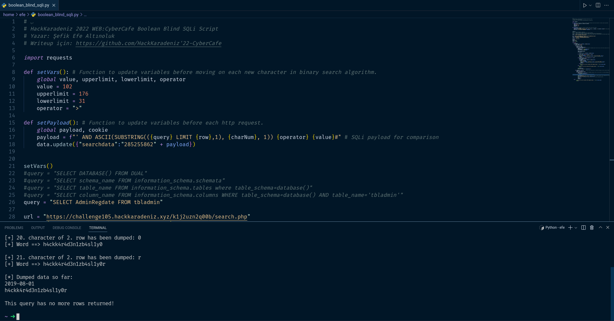</div>

# Problem
Flag veritabanının en saçma kolonlarından bir tanesinde olduğundan dolayı o kolona gelene kadar tabloların hepsinin isimlerini çıkarmam gerekti.

Her ne kadar otomatik de olsa bir karakter dumplamak için ortalama 8.5 HTTP request'i gittiğinden dolayı ve ara sıra kontrol etmem gerektiğinden dolayı süreç uzayıp gitti.

Hattâ bir ara bu durumdan sıkılıp yetkililere flag'in konumunu sordum. Veritabanındaki admin parolalarının yazılı olduğu kolondan 32 hanelik bir parolayı da (exploitation'da başarılı olduğumun referansı olması için) ekleyerek gönderdiğim mesaja daha detaylı bakmam gerektiği cevabını vererek konuyu kapattılar.

Neyse, en sonunda AdminRegDate isminde adminlerin sisteme kayıt tarihlerinin içinde olduğu kolonda buldum.

Bulduğumda o zamana kadar çektiğim ettiğim veriler ise hayli fazlaydı.

<div align="center">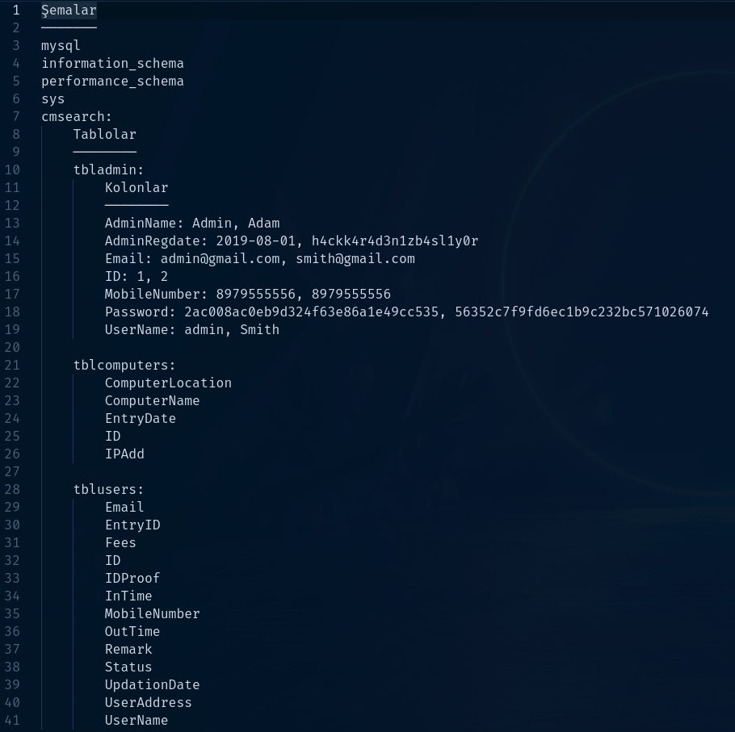</div>

---

Okuduğunuz için teşekkür ediyorum. Yapıcı geri bildirimlere açığım. İyi çalışmalar, vesselam.

Twitter: [@f4T1H21](https://twitter.com/f4T1H21)<br>
LinkedIn: [Şefik Efe](https://www.linkedin.com/in/şefik-efe)<br>
HackTheBox: [f4T1H](https://app.hackthebox.com/profile/184235)<br>
